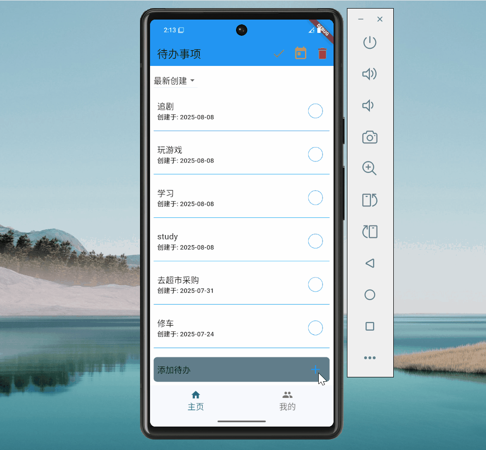
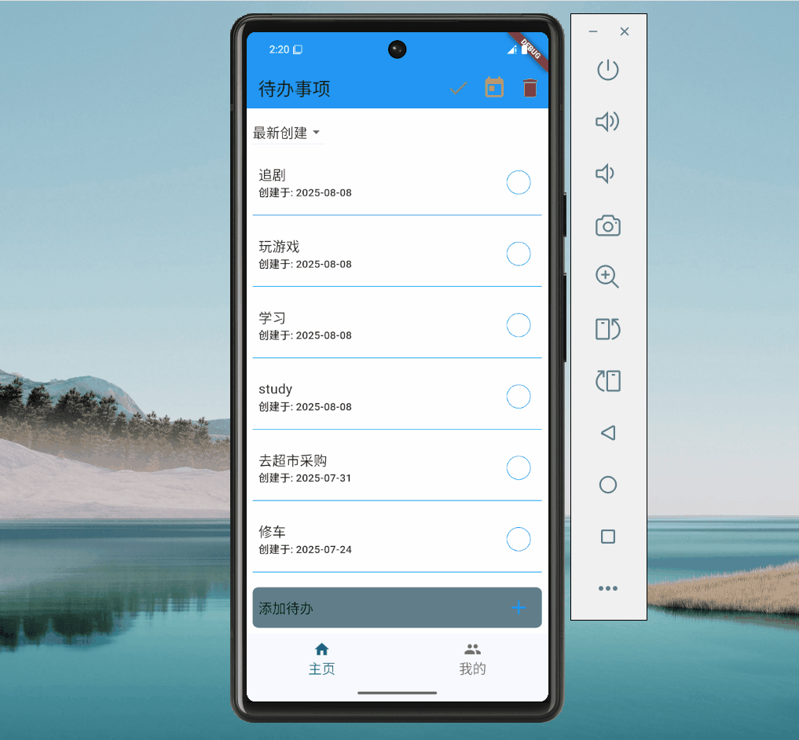
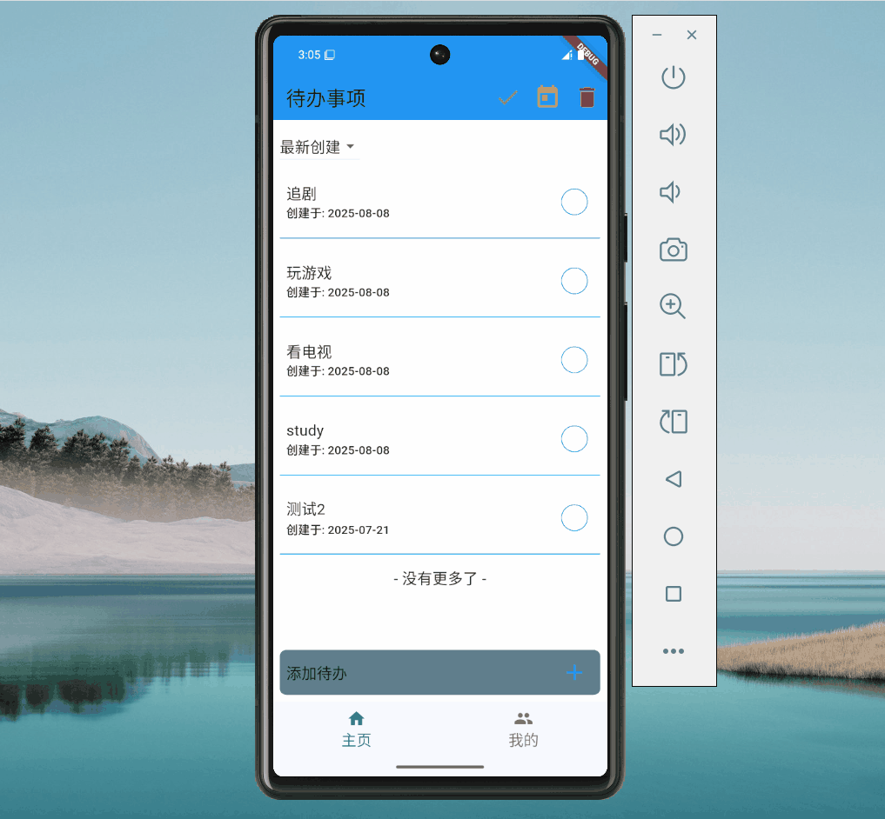
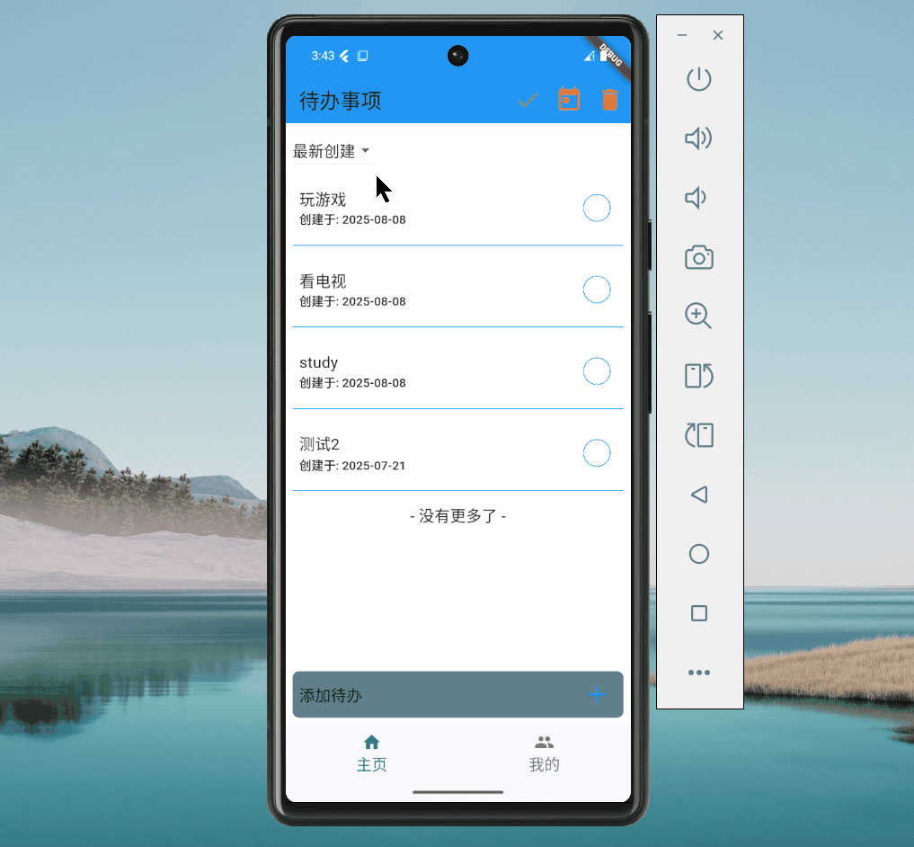
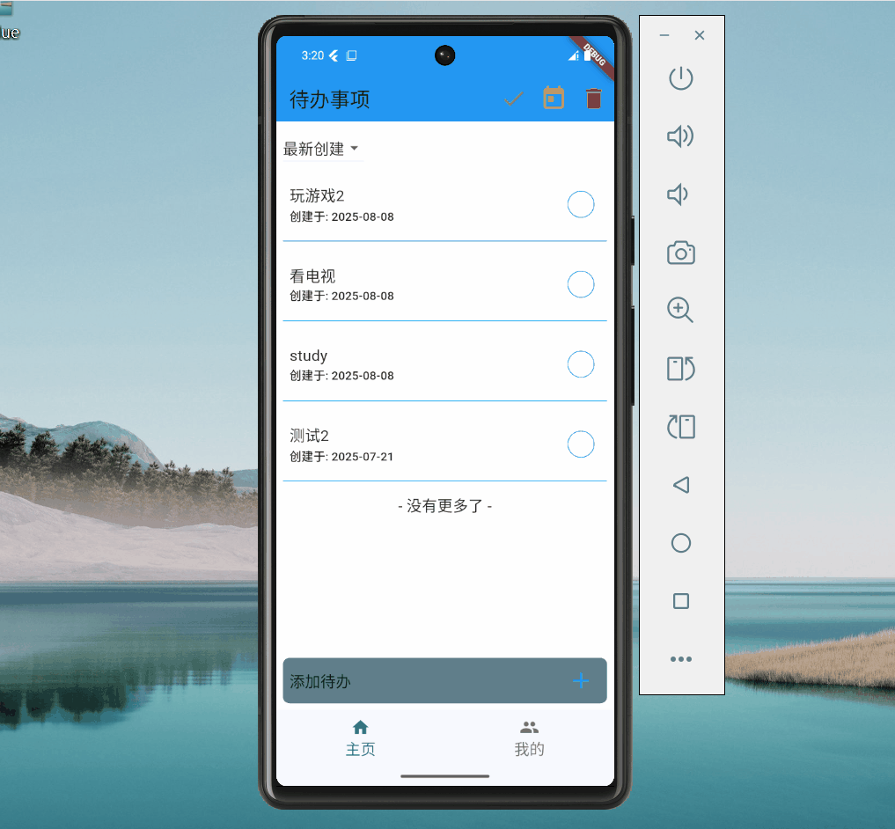
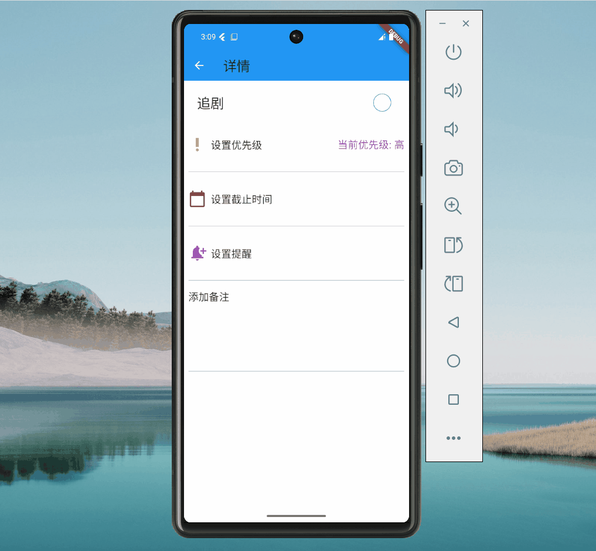
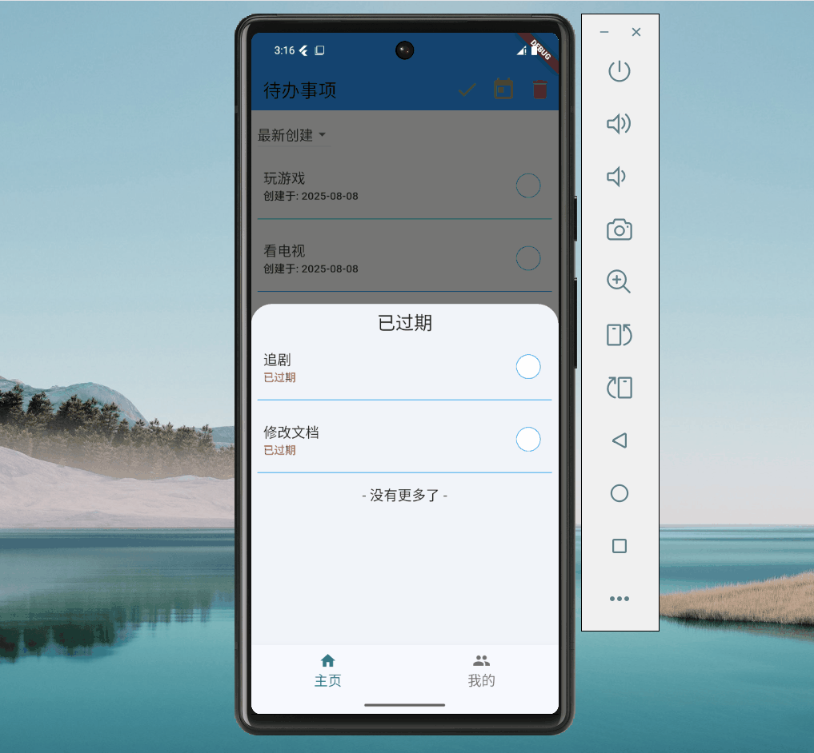
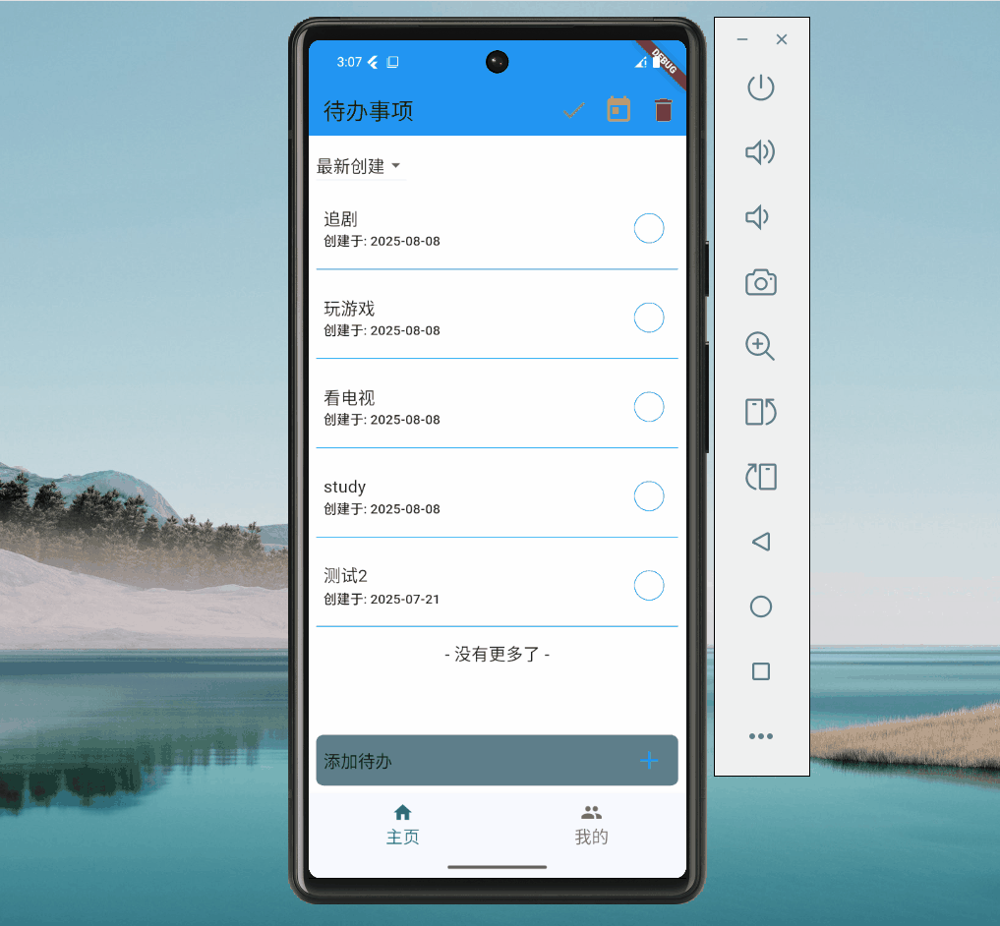
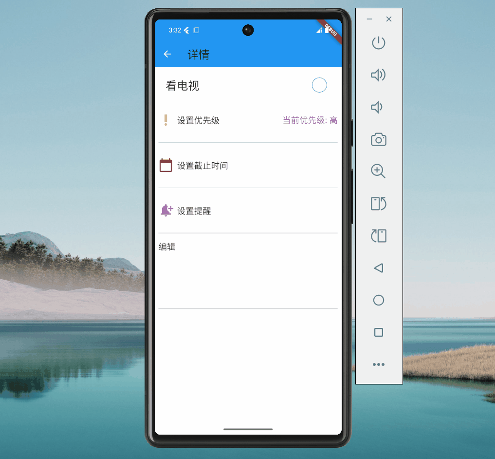

# Bubble TodoList

一个基于 **Flutter + Firebase** 的待办事项应用，采用 **Riverpod** 状态管理、**FractionallySizedBox** 实现响应式布局，支持 **离线优先的乐观更新**、动画化列表以及 **软删除 CRUD**，架构高度解耦，易于扩展与维护。

## 功能特性

* **跨平台支持**：iOS / Android / Web

* **Firebase 后端集成**：
  * Firestore 实时数据库
  * Firebase Auth（用户登录）
  * Firebase Hosting（Web 版本部署）

* **离线优先 & 乐观更新**：
  * 无网络时可编辑任务，自动同步至云端
  * 乐观更新 UI 提升交互体验

* **响应式布局**：
  * 原生 `FractionallySizedBox` 适配不同屏幕尺寸

* **列表动画**：
  * 添加 / 删除 / 更新时平滑动画过渡

* **任务管理 CRUD**：
  * 新增任务
  * 编辑任务
  * 软删除任务（可恢复）
  * 永久删除（归档清理）- 待实现

* **架构解耦**：
  * 数据层（Repository）与 UI 层分离
  * 可替换数据源（Mock / Firebase / 本地数据库）

* **登录与注册**：
  * 界面与逻辑后续版本进行优化

## 技术栈

| 层级    | 技术 / 框架                                             |
| ----- | --------------------------------------------------- |
| 前端 UI | Flutter , Material 3, FractionallySizedBox 响应式布局 |
| 状态管理  | Riverpod 2.5.1                                        |
| 后端服务  | Firebase (Firestore, Auth)                 |
| 离线缓存  | Firestore Offline Persistence + Hive              |
| 动画    | ImplicitlyAnimatedList           |
| 架构模式  | 基于 Feature 的 MVVM + Clean 混合架构                                |

## 项目结构

```plaintext
lib/
├── main.dart                  # 入口
├── core/                      # 公共工具、常量
├── features/                  # 功能模块
|   ├── auth/                  # 认证模块
│   │   ├── application/       # 状态管理层
│   │   ├── data/              # 数据层 
│   │   ├── domain/            # 领域层：业务逻辑
│   │   ├── models/            # 模型层
|   |   └── presentation/      # UI 页面
│   ├── todo/                   # 待办事项模块
│   │   ├── application/          
│   │   ├── data/               
│   │   ├── domain/             
│   │   ├── models/   
|   |   └── presentation/       
└── shared/     
    ├── application/                     
    ├── screens/             
    ├── services/           # 本地通知服务和通过平台通道调用原生安卓的时区API
    └── widgets/            
```

## ⚙️ 架构与设计

* **MVVM + Repository**
  * `View` 层只负责展示
  * `ViewModel` 层通过 `Riverpod` 管理状态
  * `Repository` 负责数据访问（Firebase / Hive）

* **解耦优势**
  * 方便替换 Firebase 为其他后端
  * UI 与数据逻辑完全分离

* **离线优先实现**
  * Firestore 离线缓存开启
  * 本地任务队列记录操作，网络恢复后批量同步

* **动画交互**
  * 列表变动时使用 `ImplicitlyAnimatedList` 提升体验

## 软删除机制

* 删除任务时不直接移除，而是标记 `isDeleted = true`
* 用户可在回收站恢复任务
* 定期清理超过一定时间的软删除数据 - 待实现

## 时区策略说明

本项目采用 UTC 存储 + 用户本地时区展示的时区处理策略。用户输入的时间明确标注对应的时区（例如“东京时间凌晨一点”），系统会将该时间转换为 UTC 统一存储。无论用户设备切换至哪个时区，展示和通知均基于当前设备时区将 UTC 转换回本地时间，确保时间点的一致性和准确性。

此方案简化了用户操作，避免了复杂的时区选择，同时清晰告知用户输入时间的时区属性。若用户输入的时间意图与标注时区不符，系统不承担自动纠正的责任，相关风险由用户自行承担。该策略符合业界主流时间管理方案，兼顾实用性与易用性。

## 通知设计说明

我将本地通知插件 `FlutterLocalNotificationsPlugin` 抽离成单独 Provider，并在其中执行初始化逻辑，仅在首次 watch 时触发。通知服务 `NotificationService` 使用 `.family(uid)` 实现多用户隔离。通过在 main() 中读取 plugin Provider，确保应用启动即完成初始化，同时避免重
复注册与内存浪费。

提醒和数据绑定需要 tid，而 tid 是在任务添加成功后才有的。为了保持架构的简洁性，我选择在添加成功后再进入详情页去设置提醒、标签等操作。未来如果产品复杂度需要，可以引入 UUID 草稿机制。

## 截图预览

添加



完成



删除



排序



修改 title



修改优先级



设置截止日期



设置通知



修改备注



模式切换


